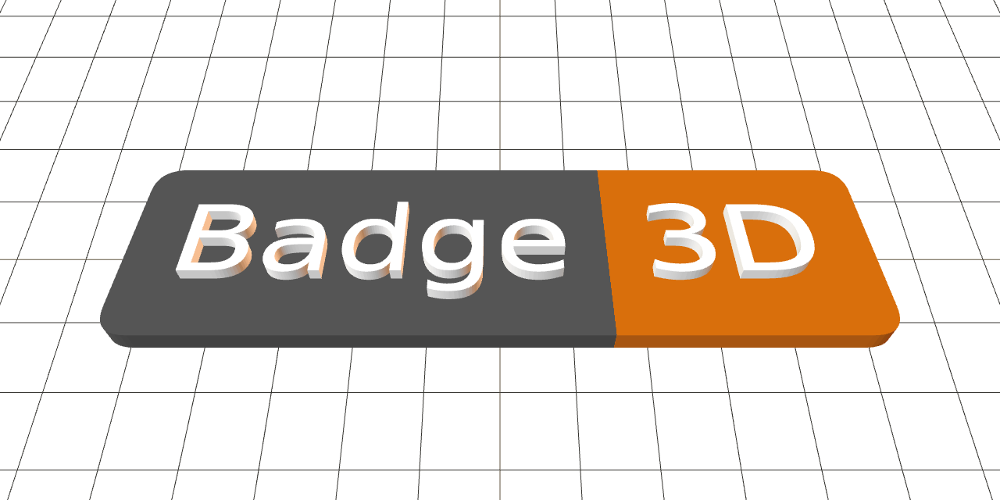
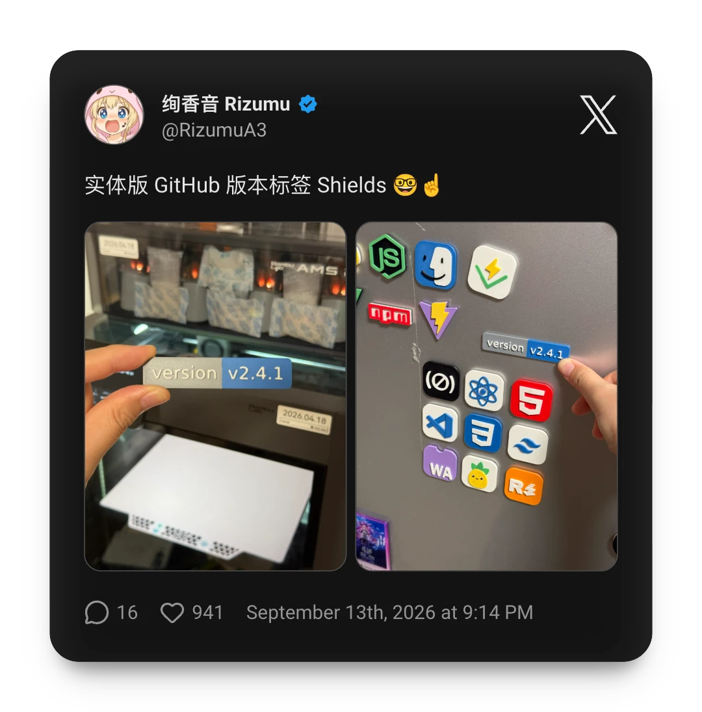

Badge3D is a Vite React SPA that turns Shields.io SVG badges into
configurable 3D-printable models. SVG parsing, 3D previewing, and 3MF/STL export
run in the browser, including fetching badges directly from Shields.io.

## Export formats

- **Multicolor 3MF** - aligned color parts with Bambu Studio filament colors. Open as
  a project to load the exported colors; importing geometry alone uses the
  current project's filaments.
- **Single-color STL** - one universal mesh for single-material printing
- **Color STL ZIP** - one aligned STL per source color for manual extruder assignment

## User showcase

Here are some 3D badges printed and shared by Badge3D users on social media.

  

## License

MIT
