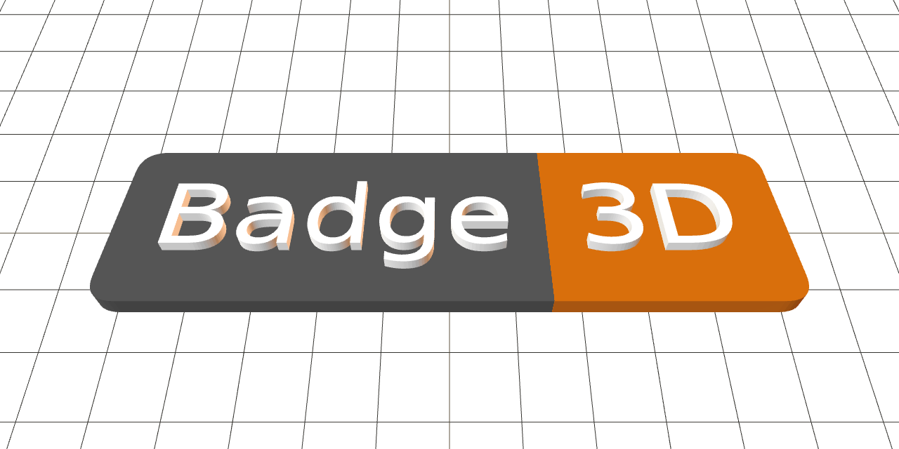
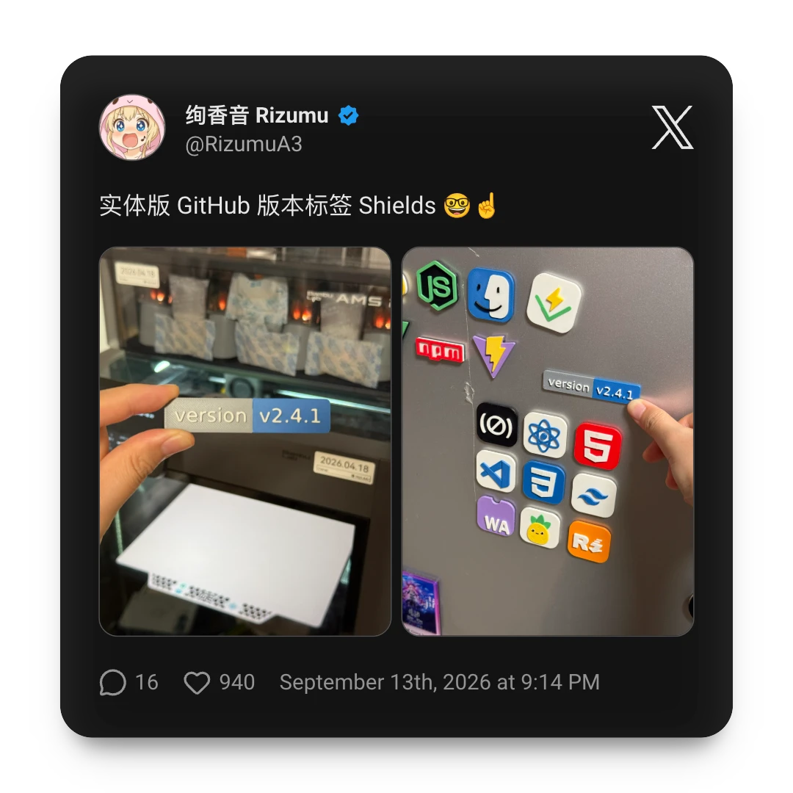
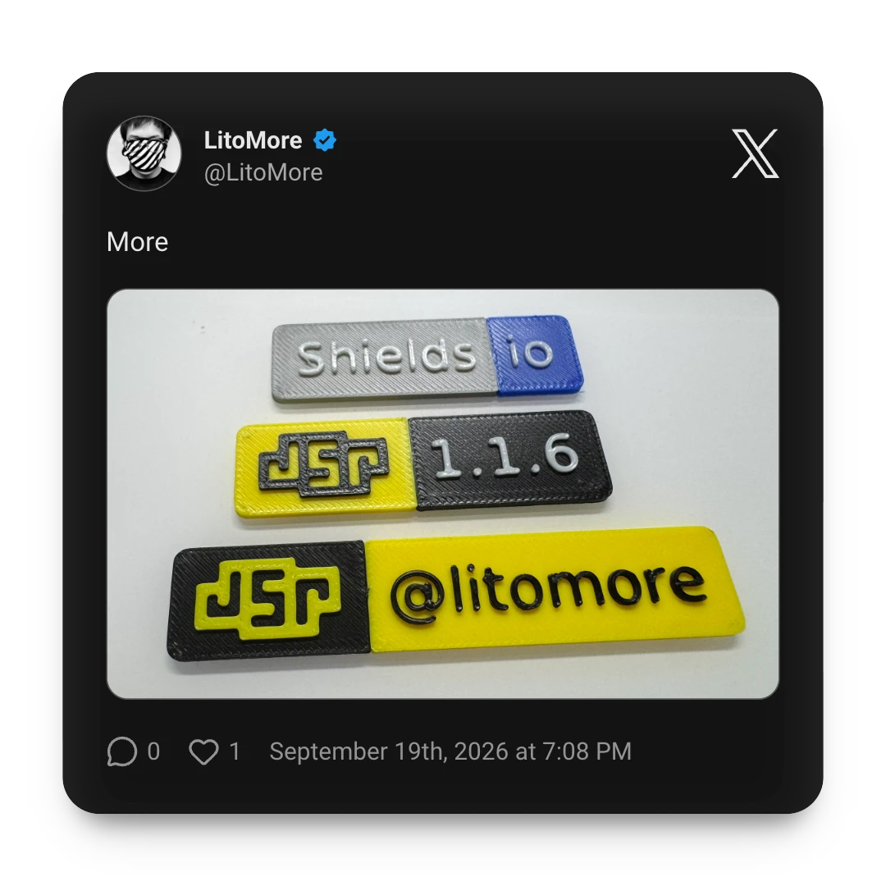
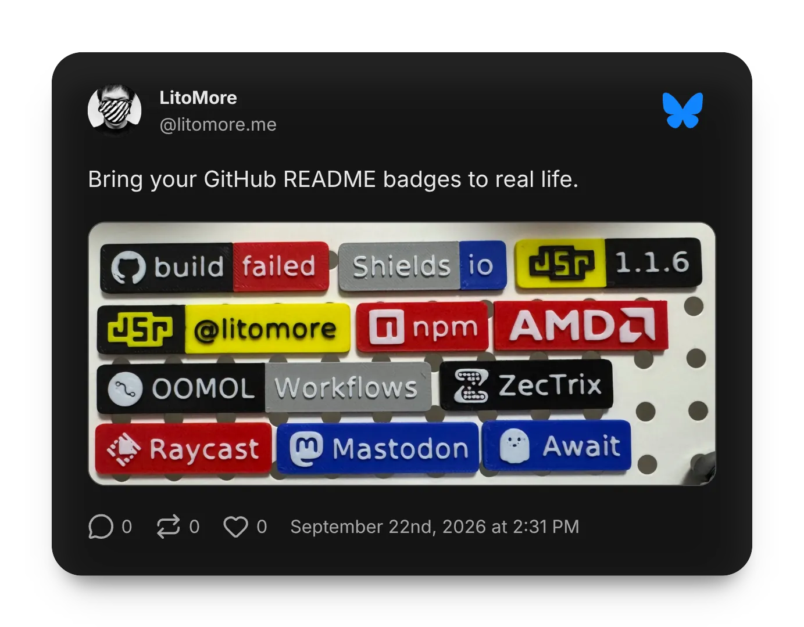

Badge3D is a Vite React SPA that turns Shields.io SVG badges into
configurable 3D-printable models. SVG parsing, 3D previewing, and 3MF/STL export
run in the browser, including fetching badges directly from Shields.io.

## Share a badge

Click **Copy shareable link** below the URL input to share the current badge URL.
Opening `https://3d.shields.io/?badgeUrl=<encoded Shields.io URL>` automatically
loads the badge, then clears the query parameters from the address bar without
reloading the page. Print dimensions use their defaults.

## Export formats

- **Multicolor 3MF** - aligned color parts with Bambu Studio filament colors. Open as
  a project to load the exported colors; importing geometry alone uses the
  current project's filaments.
- **Single-color STL** - one universal mesh for single-material printing
- **Color STL ZIP** - one aligned STL per source color for manual extruder assignment

## CJK text

Chinese (simplified and traditional), Japanese, and Korean text is converted to
raised outlines in the preview and all export formats, including mixed Latin/CJK
labels. DejaVu Sans remains the primary font. If it lacks a character, Badge3D
loads the bundled Noto Sans CJK SC Regular font (about 16 MB) on demand and reuses
it for the rest of the session. Export becomes available when the model is ready.
Characters missing from both fonts produce an error instead of placeholder boxes.

Noto Sans CJK uses Simplified Chinese forms for shared Han characters. The font
is distributed under the [SIL Open Font License](./public/fonts/OFL.txt); see
[font provenance](./public/fonts/README.md).

## User showcase

Here are some 3D badges printed and shared by Badge3D users on social media.

  
  
  

## License

MIT
